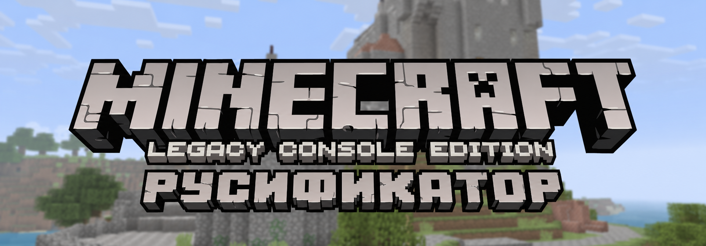

# Minecraft Legacy Rus

[](https://github.com/kotobarsik/minecraft-legacy-rus/releases/latest)
[](https://github.com/kotobarsik/minecraft-legacy-rus/releases/download/v0.1.0/Minecraft-Legacy-Rus.zip)
[](#требования)
[](scripts/install.ps1)

## Что это

Неофициальный русификатор для Windows64-версии Minecraft Legacy Console Edition.

Он добавляет русский язык и может включить его даже в сборках, где меню выбора языка недоступно.

## Что проект не содержит

В репозитории и релизном ZIP нет файлов игры:

- `.arc`;
- `.exe`;
- `.dll`;
- изменённых сборок Minecraft.

Русификатор работает только с вашей локальной копией игры.

## Требования

- Windows64-сборка Minecraft Legacy Console Edition.
- Папка игры `LCEWindows64`.
- Интернет во время установки.

Скачать игру можно со страницы проекта MCLCE:

[Minecraft Legacy Console Edition - Nightly Client Release](https://github.com/MCLCE/MinecraftConsoles/releases/tag/nightly)

На странице релиза скачайте `LCEWindows64.zip` и распакуйте его. Внутри должен быть файл:

```text
Common\Media\MediaWindows64.arc
```

## Установка

1. Закройте игру.
2. Скачайте [Minecraft-Legacy-Rus.zip](https://github.com/kotobarsik/minecraft-legacy-rus/releases/download/v0.1.0/Minecraft-Legacy-Rus.zip).
3. Распакуйте архив русификатора.
4. Запустите `install-russian.bat`.
5. Если установщик попросит путь, укажите папку `LCEWindows64`.

## Возврат английского

1. Закройте игру.
2. Запустите `restore-english.bat`.
3. Запустите игру.

Английский восстанавливается из бэкапа, который создаётся при первой установке.

## Частые проблемы

**Установщик не нашёл игру**  
Укажите путь именно к папке `LCEWindows64`, а не к файлу `MediaWindows64.arc`.

**Русский не появился**  
Закройте игру перед установкой и запустите `install-russian.bat` ещё раз.

**Нет интернета во время установки**  
Подключите интернет и повторите запуск. Установщик скачивает исходные файлы перевода во время работы.

Больше вариантов ручного запуска: [docs/TROUBLESHOOTING.md](docs/TROUBLESHOOTING.md).

## Предыстория проекта

Однажды захотелось поностальгировать по старой консольной версии Minecraft: знакомому меню, звукам, интерфейсу и ощущению той самой Legacy Console Edition.

Во время настройки Windows64-сборки выяснилось, что русского языка в игре нет, а меню выбора языка в некоторых вариантах сборки недоступно.

Так появился этот русификатор.
